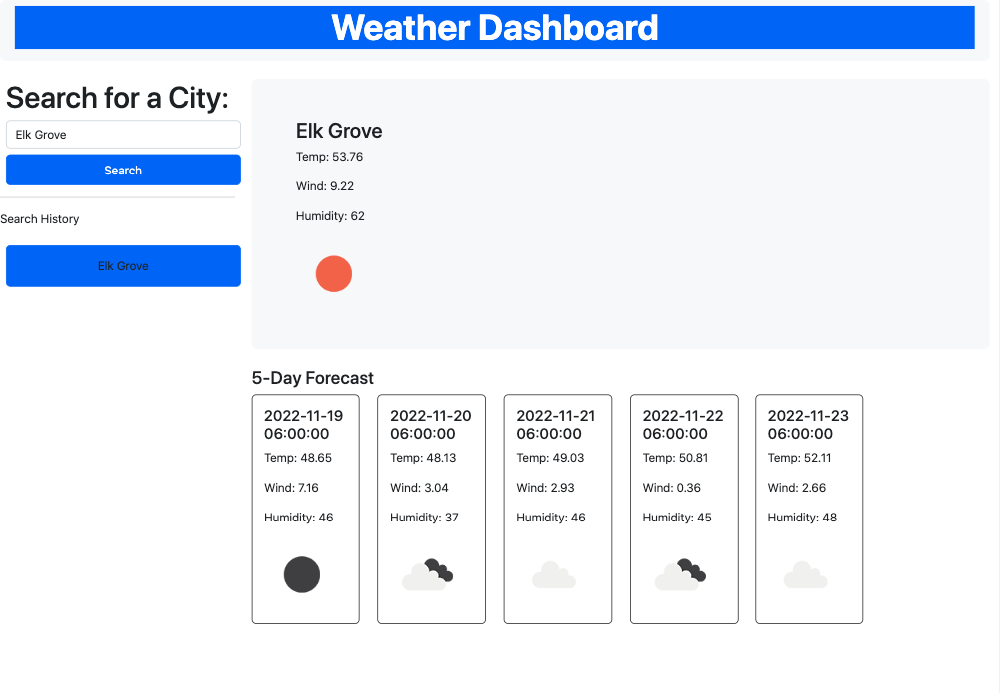

# Weather Dashboard

[Click Here for Deployed Link](https://iqbalahmadi.github.io/Weather-Report/)

  

## Description

This application retrieves weather data for cities. It presents the user with current and future conditions for searched city and that city is added to the search history. Also, it updates the user with a 5-day forecast that displays the date, an icon representation of weather conditions, the temperature, the wind speed, and the humidity.

## Mock-Up

The following image shows the web application's appearance and functionality:

## Built With

- HTML
- JavaScript
- Bootstrap

  

